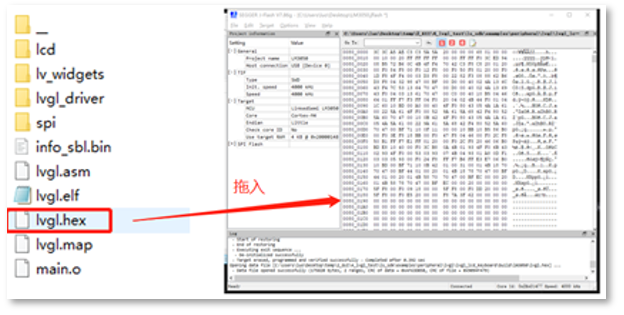

# ble_uart_tool使用介绍
## 目录

[TOC]

## 概述

本文描述如何基于 Linkedsemi LE5010芯片实现蓝牙无线串口通信

## 开发环境

### 1.硬件环境

两块Dongle_v1.0开发板


芯片占用资源
			1）GPIO:   

​				UART：TX-PB13   RX-PB12

​	2）UART：用于串口通信

​	3）FLASH：存放串口配置信息

​	

### 2.软件环境

VsCode、LM3050 SDK、J-Link烧录软件

1）VsCode和J-Link烧录软件安装教程：[VSCode — Linkedsemi Documentation Center 文档 (ls-doc.readthedocs.io)](https://ls-doc.readthedocs.io/zh_CN/latest/src/sdk/getting_started/vscode.html)

2）代码路径：ble_uart_tool\ble_single_role
3）文档结构

```c
+-- doc  	//原理图文件
+-- hal_driver 	//驱动文件
+-- module	//功能模块
+-- project	//工程代码
+-- soc		//芯片
```

## 工作原理

### 1.主机：


​	1）通过串口调试助手，向从机发送命令、或者发送数据，主机通过蓝牙将数据发送给从机

​	2）通过蓝牙接收从机发过来的数据，通过串口发送给电脑

### 2.主机：


​	1）从机接收到主机的数据后，通过串口发送给设备

​	2）设备通过串口将数据发送给从机，从机通过蓝牙将数据发送给主机

## 主机命令

1.设置波特率命令：

​	1）固定两个字节的帧头：A5 5A

​	2）四个字节的波特率：波特率转成十六进制后，大端排序

​	如：设置波特率为9600  - >  9600的四个字节十六进制是0x00002580，故发送A5 5A 80 25 00 00

2.设置校验位命令：待定

## 工作日志

1.主从机切换：通过按下按键进行主从机切换，通过串口调试助手可以看到主从切换产生的日志，并且切换的时候会将波特率重置为115200（当忘记波特率设置为多少的时候，可以进行重置）

2.主机从机日志

​	1）上电时，主机会从FALSH的0x50000地址读取波特率，如果没有存入波特率，则设置波特率为115200，然后打印自身的波特率。通过蓝牙连接从机，连接成功后，将波特率同步给从机


​	2）从机切换成主机时，会将FALSH中0x50000地址的波特率数据清除，然后自行软件复位。主机波特率将被重置为115200，同时通过蓝牙连接从机，将从机波特率同步为115200


​	3）电脑向主机发送修改波特率的命令时，主机会将波特率存入FALSH的0x50000地址，然后主机自行软复位。复位后，读取FLASH里的波特率，初始化为FLASH里的波特率，通过蓝牙连接从机，将波特率同步给从机


2）主机上电连接从机，并向从机发送一串字符：1234

​		主机上电 -> 打印当前为主机 -> 当前主机波特率 -> 连接从机 -> 与同步从机波特率 -> 从机将波特率写入FLASH的0x50000地址

 						->从机自行软复位 -> 断开连接- > 重新连接 -> 发送数据


## 运行工程

### 1.实物连接图

1）主机连接电脑：


2）从机连接设备：


### 2.编译并烧录代码

编译工程并将生成的 lvgl_lcd_keyboard\build\lm3050\lvgl.hex 文件烧录到开发板



### 3.运行现象

参考工作日志
